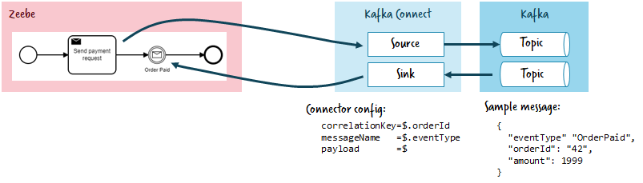
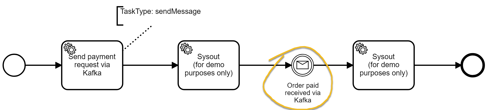
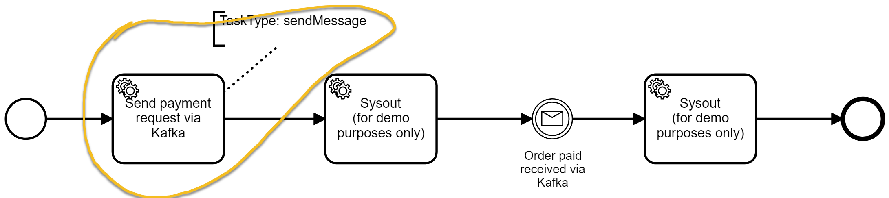

# kafka-connect-zeebe

[Kafka Connect](https://docs.confluent.io/2.0.0/connect/)or for [Zeebe.io](http://zeebe.io/)

**This is a prototype for a POC - it is not production ready!**

See this blog post for an introduction: https://zeebe.io/blog/2018/12/writing-an-apache-kafka-connector-for-zeebe/

Features:
* Correlate messages from a Kafka topic with Zeebe workflows.
* Send messages from a workflow in Zeebe to a Kafka topic.

# Installation

* Build via mvn package 
* Find the plugin package under `target/components/packages`, which will be a ZIP file: e.g. `target/components/packages/zeebe-io-kafka-connect-zeebe-1.0.0.zip`
* Follow the [plugin installation instructions](https://docs.confluent.io/current/connect/managing/install.html#connect-install-connectors)

# Quickstart

## Docker

The quickest way to get a feel for how this connector works (or to test it during development) is to use the provided [docker/docker-compose.yml](blob/master/docker/docker-compose.yml) file.

After building the project and running `docker-compose up` in the `docker/` folder, or a simple `make build docker` from the project root, the following services will be started:

1. Zeebe broker (ports: 26500 for communication, 9600 for monitoring)
1. Operate (port: 8080)
1. Elasticsearch (port: 9200) (required by Operate)
1. Kafka (port: 9092)
1. Zookeeper (port: 2181) (required by Kafka)
1. Confluent Schema Registry (port: 8081)
1. Confluent Kafka Connect (port: 8083)
1. Confluent Control Center (port: 9021)

You can use Operate (e.g. [localhost:8080](http://localhost:8080) to monitor workflows, and use Control Center e.g. [localhost:9021](http://localhost:9021) to monitor Kafka, create connectors, etc.

Running `make monitor` once all services are up and running will open the respective pages. 

# Reference

The plugin comes with two connectors, a source and a sink connector. 

The source connector activates Zeebe jobs, publishes them as Kafka records, and completes them once they have been committed to Kafka.

## Sink connector

In a workflow model you can wait for certain events by name (extracted from the payload by messageNameJsonPath):

 
The sink connector consumes Kafka records and publishes messages constructed from those records to Zeebe.
This uses the [Zeebe Message Correlation](https://docs.zeebe.io/reference/message-correlation.html) features.
So for example if no matching workflow instance is found, the message is buffered for its time-to-live (TTL) and then discarded. 
You could simply ingest all messages from a Kafka topic and check if they correlate to something in Zeebe.

### Configuration

In order to communicate with Zeebe, the connector has to create a Zeebe client, which must be configured with the following properties:

- `zeebe.client.broker.contactPoint`: the Zeebe broker address, specified as `host:port`; defaults to `localhost:26500`
- `zeebe.client.requestTimeout`: timeout in milliseconds for requests to the Zeebe broker; defaults to `10000` (or 10 seconds)

> For client and job worker configuration, we reuse the system properties as used by Zeebe, so if you already have a properties file 
  for those they should simply work.

The connector does not yet support [schemas](https://docs.confluent.io/current/schema-registry/connect.html), and currently expect
all records to be JSON. Therefore, in order to properly construct a message, we use JSON path to extract properties from the Kafka
record. These paths are all configurable per connector.

- `message.path.correlationKey`: JSONPath query to use to extract the correlation key from the record; defaults to `$.correlationKey`
- `message.path.messageName`: JSONPath query to use to extract the message name from the record; defaults to `$.messageName`
- `message.path.timeToLive`: JSONPath query to use to extract the time to live from the record; defaults to `$.timeToLive`
- `message.path.variables`: JSONPath query to use to extract the variables from the record; defaults to `$.variables`

You can find sample properties for the sink connector [here](blob/master/config/quickstart-zeebe-sink.properties).

## Source

Similar to receiving a message, in a workflow model you can also throw messages (i.e. the message throw event). Zeebe does not yet support
this BPMN feature; what we can do to allow communication with external systems through Kafka, however, is use service tasks.

In a workflow you can then add a [ServiceTask](https://docs.zeebe.io/bpmn-workflows/service-tasks.html) with a configurable task type which will create a record on the configured Kafka topic:

Under the hood, the connector will create one [job worker](https://docs.zeebe.io/basics/job-workers.html) per configured task type, consume their jobs, and publish records
to Kafka based on those. As we do not yet support schemas, the record values are a JSON representation of the job itself, and the record keys are the job key.

### Configuration

In order to communicate with Zeebe, the connector has to create a Zeebe client, which must be configured with the following properties:

- `zeebe.client.broker.contactPoint`: the Zeebe broker address, specified as `host:port`; defaults to `localhost:26500`
- `zeebe.client.requestTimeout`: timeout in milliseconds for requests to the Zeebe broker; defaults to `10000` (or 10 seconds)

> For client and job worker configuration, we reuse the system properties as used by Zeebe, so if you already have a properties file 
  for those they should simply work.
  
- `zeebe.client.worker.maxJobsActive`: the maximum number of jobs that the worker can activate in a single request; defaults to `100`
- `zeebe.client.job.worker`: the worker name; defaults to `kafka-connector`
- `zeebe.client.job.timeout`: how long before a job activated by the worker is made activatable again to others, in milliseconds; defaults to `5000` (or 5 seconds)
- `job.types`: a comma-separated list of job types that should be consumed by the connector; defaults to `kafka`
- `job.header.topics`: the [custom service task header](https://docs.zeebe.io/bpmn-workflows/service-tasks.html#task-headers) which specifies to which topics the message should be published to; defaults to `kafka-topic`

You can find sample properties for the source connector [here](blob/master/config/quickstart-zeebe-source.properties).

### Filtering Variables

You can filter the variables being sent to Kafka by adding a custom header to the "sendMessage" task with the configuration option "job.variables".

Set the value of this key to a comma-separated list of variables to pass to Kafka.

If this custom header is not present, then all variables in the scope will be sent to Kafka by default.

