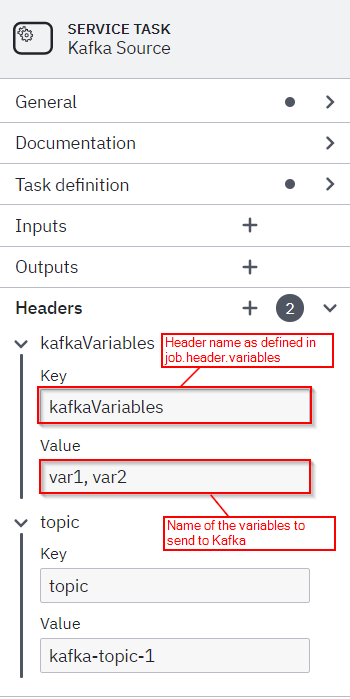

# kafka-connect-zeebe

This [Kafka Connect](https://docs.confluent.io/current/connect/index.html) connector for [Zeebe](https://zeebe.io) can do two things:

* **Send messages to a Kafka topic** when a workflow instance reached a specific activity. Please note that a `message` is more precisly a kafka `record`, which is also often named `event`. This is a **source** in the Kafka Connect speak.

* **Consume messages from a Kafka topic and correlate them to a workflow**. This is a Kafka Connect **sink**.

It can work with [Camunda Cloud](https://camunda.com/products/cloud/) or a standalone Zeebe broker.

See this [blog post](https://zeebe.io/blog/2018/12/writing-an-apache-kafka-connector-for-zeebe/) for some background on the implementation.

# Examples

**[Examples](examples)**

# Installation and quickstart

You will find information on **how to build the connector** and **how to run Kafka and Zeebe** to get started quickly here:

**[Installation](examples#setup)**

# Connectors

The plugin comes with two connectors, a source and a sink connector.

The source connector activates Zeebe jobs, publishes them as Kafka records, and completes them once they have been committed to Kafka.

## Sink connector

In a workflow model you can wait for certain events by name (extracted from the payload by messageNameJsonPath):

The sink connector consumes Kafka records and publishes messages constructed from those records to Zeebe.
This uses the [Zeebe Message Correlation](https://docs.zeebe.io/reference/message-correlation.html) features.
So for example if no matching workflow instance is found, the message is buffered for its time-to-live (TTL) and then discarded.
You could simply ingest all messages from a Kafka topic and check if they correlate to something in Zeebe.

### Configuration

In order to communicate with the Zeebe workflow engine, the connector has to create a Zeebe client. 

#### Camunda Cloud Properties

If you want to connect to Camunda Cloud, you can use these properties:

- `zeebe.client.cloud.clusterId`: Cluster ID you want to connect to. The Cluster must run on the public Camunda Cloud
- `zeebe.client.cloud.clientId`: Client ID for the connection. Ideally, create dedicated client credentials for this communication using the Camunda Cloud Console.
- `zeebe.client.cloud.clientSecret`: The Client Secret required
- `zeebe.client.requestTimeout`: timeout in milliseconds for requests to the Zeebe broker; defaults to `10000` (or 10 seconds)

#### Zeebe Broker Properties

If you want to connect to a Zeebe broker hosted yourself (e.g. running on localhost), use these properties:

- `zeebe.client.broker.contactPoint`: the Zeebe broker address, specified as `host:port`; defaults to `localhost:26500`
- `zeebe.client.requestTimeout`: timeout in milliseconds for requests to the Zeebe broker; defaults to `10000` (or 10 seconds)
- `zeebe.client.security.plaintext`: disable secure connections to the gateway for local development setups

#### Common Configuration

> For client and job worker configuration, we reuse the system properties as used by Zeebe, so if you already have a properties file
  for those they should simply work.

The connector does not yet support [schemas](https://docs.confluent.io/current/schema-registry/connect.html), and currently expect
all records to be JSON. Therefore, in order to properly construct a message, we use JSON path to extract properties from the Kafka
record. These paths are all configurable per connector.

- `message.path.correlationKey`: JSONPath query to use to extract the correlation key from the record; defaults to `$.correlationKey`
- `message.path.messageName`: JSONPath query to use to extract the message name from the record; defaults to `$.messageName`
- `message.path.timeToLive`: JSONPath query to use to extract the time to live from the record; defaults to `$.timeToLive`
- `message.path.variables`: JSONPath query to use to extract the variables from the record; defaults to `$.variables`

You can find sample properties for the sink connector [here](config/quickstart-zeebe-sink.properties).

## Source

Similar to receiving a message, in a workflow model you can also throw messages (i.e. the message throw event). Zeebe does not yet support
this BPMN feature; what we can do to allow communication with external systems through Kafka, however, is use service tasks.

In a workflow you can then add a [ServiceTask](https://docs.zeebe.io/bpmn-workflows/service-tasks.html) with a configurable task type which will create a record on the configured Kafka topic:

Under the hood, the connector will create one [job worker](https://docs.zeebe.io/basics/job-workers.html) per configured task type, consume their jobs, and publish records
to Kafka based on those. As we do not yet support schemas, the record values are a JSON representation of the job itself, and the record keys are the job key.

### Configuration

In order to communicate with Zeebe, the connector has to create a Zeebe client, which must be configured with the following properties:

- `zeebe.client.broker.contactPoint`: the Zeebe broker address, specified as `host:port`; defaults to `localhost:26500`
- `zeebe.client.requestTimeout`: timeout in milliseconds for requests to the Zeebe broker; defaults to `10000` (or 10 seconds)

> For client and job worker configuration, we reuse the system properties as used by Zeebe, so if you already have a properties file
  for those they should simply work.

- `zeebe.client.worker.maxJobsActive`: the maximum number of jobs that the worker can activate in a single request; defaults to `100`
- `zeebe.client.job.worker`: the worker name; defaults to `kafka-connector`
- `zeebe.client.job.timeout`: how long before a job activated by the worker is made activatable again to others, in milliseconds; defaults to `5000` (or 5 seconds)
- `job.types`: a comma-separated list of job types that should be consumed by the connector; defaults to `kafka`
- `job.header.topics`: the [custom service task header](https://docs.zeebe.io/bpmn-workflows/service-tasks.html#task-headers) which specifies to which topics the message should be published to; defaults to `kafka-topic`

You can find sample properties for the source connector [here](config/quickstart-zeebe-source.properties).

### Filtering Variables

You can filter the variables being sent to Kafka by adding a custom header to the "sendMessage" task with the configuration option "job.variables".

Set the value of this key to a comma-separated list of variables to pass to Kafka.

If this custom header is not present, then all variables in the scope will be sent to Kafka by default.

## Configuring Error Handling of Kafka Connect, e.g. Logging or Dead Letter Queues

Kafka Connect allows you to configure what happens if a message cannot be processed. A great explanation can be found in [Kafka Connect Deep Dive – Error Handling and Dead Letter Queues](https://www.confluent.io/blog/kafka-connect-deep-dive-error-handling-dead-letter-queues). This of course also applies to this connector.

# Confluent Hub

This project is set up to be released on Confluent Hub.

When
* Building this project via `mvn package`
* You will find the plugin package as ZIP file under `target/components/packages`, e.g. `target/components/packages/zeebe-io-kafka-connect-zeebe-1.0.0.zip`
* Which can be [installed onto the Confluent Hub](https://docs.confluent.io/current/connect/managing/install.html#connect-install-connectors)

