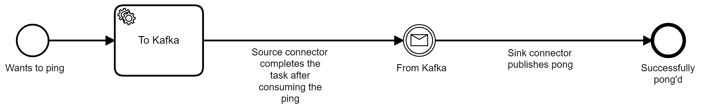

# Auto Ping Pong

This example showcases automatic workflow completion with just connectors, using
the following [process](process.bpmn)



The first service task is consumed by the source connector, which produces a record
on the `auto-pong` topic. The record will contain the variables of the job, including 
the correlation key for the intermediate message catch event. This record is then consumed
by the sink connector which will publish a message with the correlation key based on the job
which will then complete the workflow.

## Running the example

The simplest way to run through it is to use the provided `Makefile`. If that's not an
option on your system, then you can run all the steps manually.

### Requirements

To run the example you need the following tools on your system:

1. [docker-compose](https://docs.docker.com/compose/)
1. [maven](https://maven.apache.org/) (to build the project)

### Makefile

> To use the `Makefile` you will also need [curl](https://curl.haxx.se/).

Before starting, you need to make sure that the connector was built and the docker services are
up and running. You can use the `Makefile` in the root folder of the project, and run the following:

#### Start services

```shell
make build docker docker-wait-zeebe docker-wait-connect
```

This will ensure that everything is up and running before we start. You can then monitor your system
using Confluent Control Center (on port `9021`, e.g. `http://localhost:9021`), and Operate (on port 
`8080`, e.g. `http://localhost:8080`).

#### Deploy workflow and connectors

Once everything is up and running, you can start the example by running:

```shell
make deploy-workflow create-source-connector create-sink-connector
```

#### Create an instance

You can now create a workflow instance of the `auto-ping-pong` process; this instance will start,
create a job which is consumed by the source connector. The source connector produces a record on the `auto-pong`
topic, which is consumed by the sink connector. The sink connector then publishes a message back to Zeebe.

To create the instance, run:

```shell
make id=1 create-workflow
```

You can change the ID when creating more workflows.


### Manually

If `make` is not available on your system (if on Windows, WSL could help there), then you can run
steps manually:

Build the project by running

```shell
mvn clean package
```

Copy the resulting development connector folder at `target/kafka-connect-zeebe-*-development/share/java/kafka-connect-zeebe` 
(replacing the star by the version, e.g. `1.0.0-SNAPSHOT`) to `docker/connectors/kafka-connect-zeebe`

Now start all docker services:

```shell
docker-compose -f docker/docker-compose.yml up -d
```


To ensure all services are up and running, you query the following URLs, which should return 2xx
responses: `http://localhost:9600/ready` (Zeebe ready check) and `http://localhost:8083/` (Kafka
Connect API endpoint)

Once everything is up and running, deploy the workflow. 
First, we need to copy the process file into the Zeebe container.

```shell
docker cp examples/auto-ping-pong/process.bpmn $(shell docker-compose -f docker/docker-compose.yml ps -q zeebe):/tmp/process.bpmn
docker-compose -f docker/docker-compose.yml exec zeebe zbctl deploy /tmp/process.bpmn
```

Now create the source connector:
```shell
curl -X POST -H "Content-Type: application/json" --data @examples/auto-ping-pong/source.json http://localhost:8083
```

Next, create the sink connector:

```
curl -X POST -H "Content-Type: application/json" --data @examples/auto-ping-pong/source.json http://localhost:8083
```

After this we can now create a workflow instance:

```shell
docker-compose -f docker/docker-compose.yml exec zeebe \
	zbctl create instance --variables "{\"name\": \"auto-pong\", \"payload\": { \"foo\": 1}, \"key\": 1}" auto-ping-pong
```
