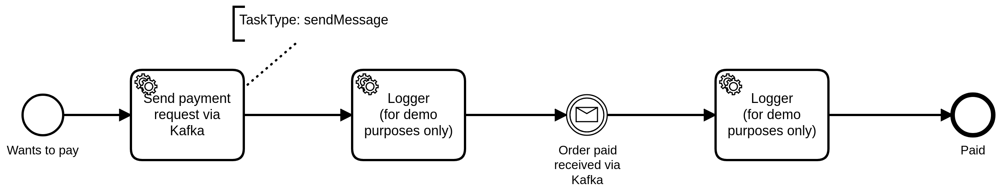

# Flow Retail

This example showcases how Zeebe could integrate into a micro service architecture
where Kafka is used as an event bus. Once a workflow instance is created, a service
task is consumed by the source connector, which publishes a record on a particular topic.

An external service can then consume that record, process it, and publish the results back
on a different topic which will be processed by the sink connector. The sink connector then
completes the workflow instance by publishing a message back to Zeebe based on the results
of the work done by the external system (or systems). 



> The `Logger` tasks are there mostly for demo purposes to better visualize the flow.

In this example, we'll be simulating the external payment confirmation process by manually producing
records to the `payment-confirm` .

To complete the message we will then use the [kafka-console-producer](https://kafka.apache.org/quickstart#quickstart_send),
producing records of the following format:

```json
{
  "eventType": "OrderPaid", 
  "orderId": 1,
  "amount": 4000
}
```

> You can visualize the records published by the source connector using the [kafka-console-consumer](https://kafka.apache.org/quickstart#quickstart_consume)
  or simply Control Center. The records are published on the topic `payment-request`.

## Running the example

The simplest way to run through it is to use the provided `Makefile`. If that's not an
option on your system, then you can run all the steps manually.

Before starting, make sure you already set up everything as listed [here](https://github.com/zeebe-io/kafka-connect-zeebe/tree/master/examples#setup).

### Makefile

> To use the `Makefile` you will also need [curl](https://curl.haxx.se/).

Running `make` deploy all resources, and create a single workflow instance. Broken down into steps:

#### Deploy workflow and connectors

```shell
make workflow source sink
```

#### Create an instance

```shell
make workflow
```

#### Start the logger worker

```shell
make logger
```

#### Publishing a message

To publish a message back through the connector, we have to produce a record on the `payment-confirm` topic. The record should have the format as described above.

To publish a message, run:

```shell
make producer
```

This will start the [kafka-console-producer](https://kafka.apache.org/quickstart#quickstart_send).
Simply write the expected JSON record, e.g.:

```json
{"eventType": "OrderPaid", "orderId": 1, "amount": 4000}
``` 

### Manually

If `make` is not available on your system (if on Windows, WSL could help there), then you can run
steps manually:

#### Deploy workflow and connectors

If `curl` is not available, you can also use [Control Center](http://localhost:9021) to create the connectors.
Make sure to configure them according to the following properties: [source connector properties](source.json), [sink connector properties](sink.json)

Now create the source connector:
```shell
curl -X POST -H "Content-Type: application/json" --data @examples/flow-retail/source.json http://localhost:8083
```

Next, create the sink connector:

```
curl -X POST -H "Content-Type: application/json" --data @examples/flow-retail/source.json http://localhost:8083
```

#### Create a workflow instance

We can now create a workflow instance:

```shell
docker-compose -f docker/docker-compose.yml exec zeebe zbctl create instance --variables "{\"orderId\": 1}" flow-retail
```

Replace the value of the `orderId` variable to change the correlation key.

#### Logger worker

Open a separate console, navigate to the root project directory, and run

```shell
  mvn exec:java -Dexec.mainClass=io.zeebe.kafka.connect.LoggerWorker -Dexec.classpathScope="test" -Djob.types="payment-requested,payment-confirmed"
```

#### Confirming order (Kafka Producer)

In order to simulate the external payment confirmation service, let's start a
[Kafka producer](https://kafka.apache.org/quickstart#quickstart_send).

```shell
docker-compose -f docker/docker-compose.yml exec kafka  kafka-console-producer --request-required-acks 1 --broker-list kafka:19092 --topic payment-confirm
```

To confirm the order, we can write a record of the following format:

```json
{"eventType": "OrderPaid", "orderId": 1, "amount": 4000}
``` 

Make sure to update the `orderId` to match the expected correlation key.
