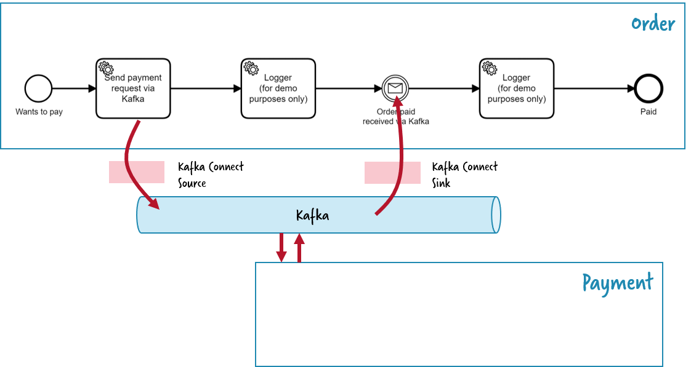

# Microservices Orchestration

This example showcases how Zeebe could orchestrate a payment microservice from within an order fulfillment microservice when Kafka is used as transport.




> The `Logger` tasks are there only demo purposes to follow along on the console.

It leverages the connector's source to push a message onto Kafka whenever a payment is required, expecting some payment service to process it and emit an event (or send a response message) later on. This response is correlated to the waiting order fulfillment process using the connectors sink.

The example needs the payment service to be simulated, means you need to publish a record to the `payment-confirm` topic. You could do that using the [kafka-console-producer](https://kafka.apache.org/quickstart#quickstart_send):

```json
{
  "eventType": "OrderPaid", 
  "orderId": 1,
  "amount": 4000
}
```

> You can visualize the records published by the source connector using the [kafka-console-consumer](https://kafka.apache.org/quickstart#quickstart_consume)
  or simply Control Center. The records are published on the topic `payment-request`.

## Prerequisites

* Install and run Kafka, Kafka Connect and Zeebe as described [here](https://github.com/zeebe-io/kafka-connect-zeebe/tree/master/examples#setup). The following description assumes that you leverage a managed Zeebe Cluster in Camunda Cloud.

## Running the example

The simplest way to run through it is to use the provided `Makefile`. If that's not an
option on your system, then you can run all the steps manually.

### Makefile

> To use the `Makefile` you will also need [curl](https://curl.haxx.se/).

Running `make` deploy all resources, and create a single workflow instance. Broken down into steps:

#### Deploy workflow and connectors

```shell
make workflow source sink
```

#### Create an instance

```shell
make workflow
```

#### Start the logger worker

```shell
make logger
```

#### Publishing a message

To publish a message back through the connector, we have to produce a record on the `payment-confirm` topic. The record should have the format as described above.

To publish a message, run:

```shell
make payment
```

This will start the [kafka-console-producer](https://kafka.apache.org/quickstart#quickstart_send).
Simply write the expected JSON record, e.g.:

```json
{"eventType": "OrderPaid", "orderId": 1, "amount": 4000}
``` 

### Manually

If `make` is not available on your system (if on Windows, WSL could help there), then you can run
steps manually:

#### Deploy workflow

Use the Camunda Modeler deploy button.

#### Deploy connectors

Hint: If `curl` is not available, you can also use [Control Center](http://localhost:9021) to create the connectors.

Make sure to configure them according to the following properties: [source connector properties](source-payment.json), [sink connector properties](sink-payment.json)

Now create the source connector:
```shell
curl -X POST -H "Content-Type: application/json" --data @payment-source.json http://localhost:8083/connectors
```

Next, create the sink connector:

```
curl -X POST -H "Content-Type: application/json" --data @payment-sink.json http://localhost:8083/connectors
```

#### Create a workflow instance

We can now create a workflow instance:

```shell
docker-compose -f docker/docker-compose.yml exec zeebe zbctl create instance --variables "{\"orderId\": 1}" order
```

Replace the value of the `orderId` variable to change the correlation key.

#### Logger worker

Open a separate console, navigate to the root project directory, and run

```shell
  docker-compose -f docker/docker-compose.yml exec zeebe /bin/bash -c \
		"zbctl create worker --handler cat --maxJobsActive 1 payment-requested & zbctl create worker --handler cat --maxJobsActive 1 payment-confirmed"
```

#### Confirming order (Kafka Producer)

In order to simulate the external payment confirmation service, let's start a
[Kafka producer](https://kafka.apache.org/quickstart#quickstart_send).

```shell
docker-compose -f docker/docker-compose.yml exec kafka  kafka-console-producer --request-required-acks 1 --broker-list kafka:19092 --topic payment-confirm
```

To confirm the order, we can write a record of the following format:

```json
{"eventType": "OrderPaid", "orderId": 1, "amount": 4000}
``` 

Make sure to update the `orderId` to match the expected correlation key.
