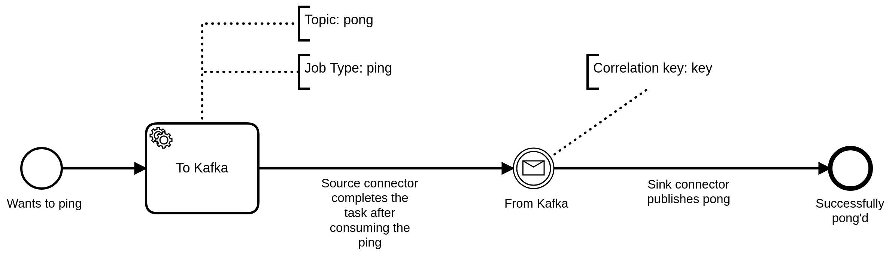

# Ping Pong

This example showcases how jobs are consumed by Kafka (e.g. `ping`), and how records can be published
to Zeebe in order to `pong`, using the following [process](process.bpmn)



The difference with the [Auto Ping Pong](../auto-ping-pong) example is that here
we need to interact with Kafka in order to complete it; this also allows us to monitor the state of
both systems, through Operate and Control Center.

Once a workflow instance is started, the process will wait at the service task.

The job created by service task is consumed by the source connector, which produces a record
on the `ping` topic. The record will contain the variables of the job, including 
the correlation key for the intermediate message catch event. Using `kafkacat` in consumer
mode, or using Control Center, you can then visualize the records currently published to this topic.

Once completed, the process will then move to the intermediate catch event; in order to proceed further,
it will require a record to be published on the `pong` Kafka topic. When that record is published,
it will then complete the workflow instance.

Records published on the `pong` topic should have the following format:

```json
{
  "name": "pong", 
  "variables": { 
    "foo": 1
  },
  "key": 1, 
  "ttl": 10000
}
```

This is so the JSON path configured in the sink connector can properly construct our Zeebe message. Note
that the key here obviously should be updated to correlate to the correct message.

## Running the example

The simplest way to run through it is to use the provided `Makefile`. If that's not an
option on your system, then you can run all the steps manually.

### Requirements

To run the example you need the following tools on your system:

1. [docker-compose](https://docs.docker.com/compose/)
1. [maven](https://maven.apache.org/) (to build the project)

### Makefile

> To use the `Makefile` you will also need [curl](https://curl.haxx.se/).

Before starting, you need to make sure that the connector was built and the docker services are
up and running. You can use the `Makefile` in the root folder of the project, and run the following:

#### Start services

```shell
make build docker docker-wait-zeebe docker-wait-connect
```

This will ensure that everything is up and running before we start. You can then monitor your system
using Confluent Control Center (on port `9021`, e.g. `http://localhost:9021`), and Operate (on port 
`8080`, e.g. `http://localhost:8080`).

#### Deploy workflow and connectors

Once everything is up and running, you can start the example by running:

```shell
make deploy-workflow create-source-connector create-sink-connector
```

#### Create an instance

You can now create a workflow instance of the `ping-pong` process; this instance will start, and create a job which is consumed by the source connector. 

To create the instance, run:

```shell
make id=1 create-workflow
```

You can change the ID when creating more workflows.

#### Publishing a message

To publish a message back through the connector, we have to produce a record on the `pong` topic. The record should have the format as described above.

To publish a message, run:

```shell
make start-producer
```

This will start the [kafka-console-producer](https://kafka.apache.org/quickstart#quickstart_send).
Simply write the expected JSON record, e.g.:

```json
{"name": "pong", "key": 1, "payload": {"foo": "bar"}}
``` 

### Manually

If `make` is not available on your system (if on Windows, WSL could help there), then you can run
steps manually:

Build the project by running

```shell
mvn clean package
```

Copy the resulting development connector folder at `target/kafka-connect-zeebe-*-development/share/java/kafka-connect-zeebe` 
(replacing the star by the version, e.g. `1.0.0-SNAPSHOT`) to `docker/connectors/kafka-connect-zeebe`

Now start all docker services:

```shell
docker-compose -f docker/docker-compose.yml up -d
```


To ensure all services are up and running, you query the following URLs, which should return 2xx
responses: `http://localhost:9600/ready` (Zeebe ready check) and `http://localhost:8083/` (Kafka
Connect API endpoint)

Once everything is up and running, deploy the workflow. 
First, we need to copy the process file into the Zeebe container.

```shell
docker cp examples/ping-pong/process.bpmn $(shell docker-compose -f docker/docker-compose.yml ps -q zeebe):/tmp/process.bpmn
docker-compose -f docker/docker-compose.yml exec zeebe zbctl deploy /tmp/process.bpmn
```

Now create the source connector:
```shell
curl -X POST -H "Content-Type: application/json" --data @examples/ping-pong/source.json http://localhost:8083
```

Next, create the sink connector:

```
curl -X POST -H "Content-Type: application/json" --data @examples/ping-pong/source.json http://localhost:8083
```

After this we can now create a workflow instance:

```shell
docker-compose -f docker/docker-compose.yml exec zeebe \
	zbctl create instance --variables "{\"name\": \"pong\", \"payload\": { \"foo\": 1}, \"key\": 1}" ping-pong
```

Then we now have to start the Kafka console producer:

```shell
docker-compose -f docker/docker-compose.yml exec kafka \
	kafka-console-producer --request-required-acks 1 --broker-list kafka:19092 --topic pong
```

This will start the [kafka-console-producer](https://kafka.apache.org/quickstart#quickstart_send).
Simply write the expected JSON record, e.g.:

```json
{"name": "pong", "key": 1, "payload": {"foo": "bar"}}
``` 
